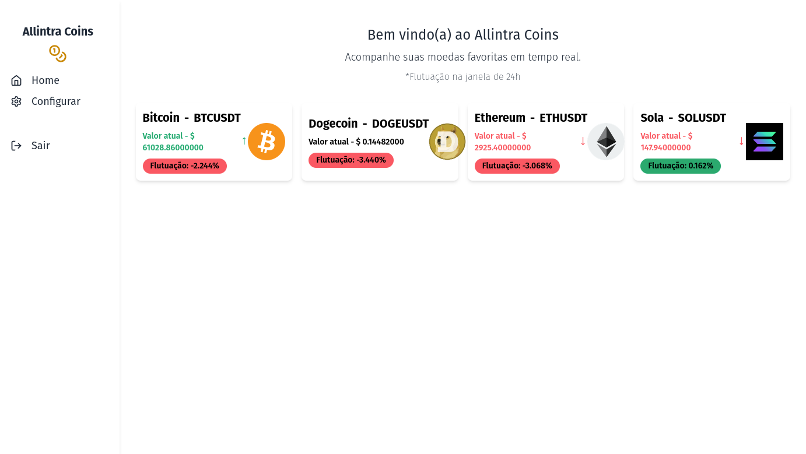
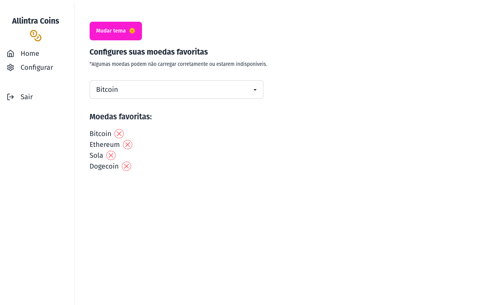
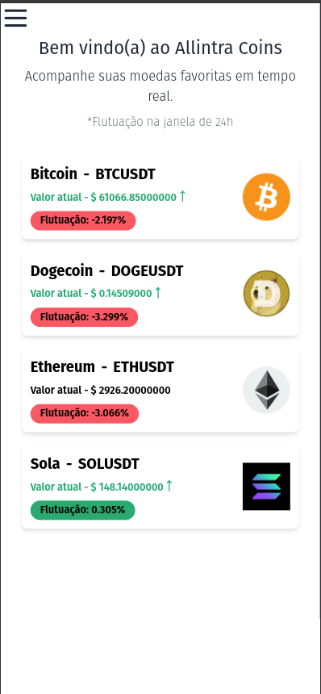

<h1 align="center" style="font-weight: bold;">Allintra Coins 🪙</h1>

<p align="center">
 <a href="#started">Instruções para iniciar</a> -
 <a href="#technologies">Tecnologias</a> 
</p>

<p align="center">
    <b>Allintra coins é um site que fornece ao usuário um dashboard no qual se pode acompanhar suas criptomoedas em tempo real.</b>
</p>

<p align="center">
     <a href="PROJECT__URL">📱 Visite o site</a>
</p>

<h2 id="layout">🎨 Layout</h2>

<p align="center">
    
    
    
</p>

<h2 id="technologies">💻 Techs</h2>

- Typescript
- React
- Tailwind
- Websockets
- Redux

<h2 id="started">🚀 Instalação</h2>

A instalação é simples

<h3>Prerequisites</h3>

- [NodeJS](https://nodejs.org/en)
- [Git](https://git-scm.com/)

<h3>Clonar</h3>

```bash
git clone https://github.com/RomuloOliveira94/allintra-coins.git
```

<h3>Iniciando o projeto</h3>

```bash
cd allintra-coins
npm install
npm run dev
```
